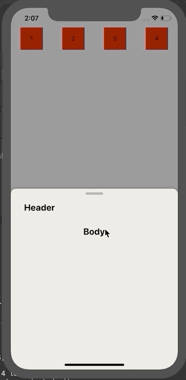

# rn-bottom_test

Cross platform scrollable bottom sheet with virtualisation support and fully native animations!!

| |
| :--------------------:|

## Installation

Open a Terminal in the project root and run:

```sh
yarn add rn-bottom_test
```

or if you use `npm`:

```sh
npm install rn-bottom_test
```

If you are using Expo, you are done.

Install and link [react-native-gesture-handler](https://kmagiera.github.io/react-native-gesture-handler/docs/getting-started.html) and [react-native-reanimated](https://github.com/kmagiera/react-native-reanimated).

## Usage

```javascript
import BottomSheet from 'rn-bottom_test';

class Example extends React.Component {
  render() {
    return (
      <View style={styles.container}>
        <BottomSheet
          keyboardAware
          bottomSheerColor="#FFFFFF"
          ref="BottomSheet"
          initialPosition={'50%'} //200, 300
          snapPoints={['50%', '100%']}
          isBackDrop={true}
          isBackDropDismissByPress={true}
          isRoundBorderWithTipHeader={true}
          // backDropColor="red"
          // isModal
          // containerStyle={{backgroundColor:"red"}}
          // tipStyle={{backgroundColor:"red"}}
          // headerStyle={{backgroundColor:"red"}}
          // bodyStyle={{backgroundColor:"red",flex:1}}
          header={
            <View>
              <Text style={styles.text}>Header</Text>
            </View>
          }
          body={
            <View style={styles.body}>
              <Text style={styles.text}>Body</Text>
            </View>
          }
        />
      </View>
    );
  }
}
```

## Props

| name                         | required | default   | description                                                                                                                                                                                                                                                                    |
| ---------------------------- | -------- | --------- | ------------------------------------------------------------------------------------------------------------------------------------------------------------------------------------------------------------------------------------------------------------------------------ |
| keyboardAware                | no       | `false`   | `true` will avoid current snap when keyboard will open.                                                                                                                                                                                                                        |
| keyboardAwareExtraSnapHeight | no       | 0         | when `keyboardAware=true` and this is for adding extra space in snap when keyboard open                                                                                                                                                                                        |
| keyboardAwareDrag            | no       | `false`   | when `keyboardAware=true` and this is used for enable or disable drag when keyboard open                                                                                                                                                                                       |
| onChangeKeyboardAwareSnap    | no       |           | when `keyboardAware=true` then it give keyboard awareview snap. ` onChangeKeyboardAwareSnap: (previousSnap: number,nextSnap: number,keyboardHeight: number) => void;`                                                                                                          |
| snapPoints                   | yes      |           | E.g. `[500, 250, 0]`. Points for snapping of bottom sheet coomponent. They define distance from bottom of the screen. Might be number or percent (as string e.g. `'10%'`) for points or percents of screen height from bottom. Note: Array values must be in descending order. |
| initialPosition              | no       | 0         | Determines initial position point of bottom sheet. The value outside of snap points.                                                                                                                                                                                           |
| body                         | no       |           | Method for rendering scrollable content of bottom sheet.                                                                                                                                                                                                                       |
| header                       | no       |           | Method for rendering non-scrollable header of bottom sheet.                                                                                                                                                                                                                    |
| isBackDrop                   | no       | `false`   | for show backdrop behind the bottom sheet.                                                                                                                                                                                                                                     |
| isBackDropDismissByPress     | no       | `false`   | enable to move bottomsheet to first snappoint by pressing backdrop.                                                                                                                                                                                                            |
| isRoundBorderWithTipHeader   | no       | `false`   | give round with tip header style to bottomsheet.                                                                                                                                                                                                                               |
| isModal                      | no       | `false`   | to make bottom sheet like modal.                                                                                                                                                                                                                                               |
| bounce                       | no       | 0.5       | for increase or decrease bounce effect                                                                                                                                                                                                                                         |
| isAnimatedYFromParent        | no       |           | If `true` then give animated value to `animatedValueY` props.                                                                                                                                                                                                                  |
| animatedValueY               | no       |           | If isAnimatedYFromParent will be `true` then it will give animtedY value to `animatedValueY` props.                                                                                                                                                                            |
| bottomSheerColor             | no       | `#ffffff` | for background color of bottom sheet.                                                                                                                                                                                                                                          |
| tipStyle                     | no       |           | for change style of tip. it is dependted on `isRoundBorderWithTipHeader`.                                                                                                                                                                                                      |
| headerStyle                  | no       |           | for change style of header.                                                                                                                                                                                                                                                    |
| bodyStyle                    | no       |           | for change style of body.                                                                                                                                                                                                                                                      |
| dragEnabled                  | no       | true      | for enable/disable drag                                                                                                                                                                                                                                                        |
| tipHeaderRadius              | no       | 12        | for tip header border radius                                                                                                                                                                                                                                                   |
| onClose                      | no       |           | Method call when bottomsheet close                                                                                                                                                                                                                                             |
| containerStyle               | no       |           | for change style of container                                                                                                                                                                                                                                                  |
| bodyContainerStyle           | no       |           | for change style of body container                                                                                                                                                                                                                                             |
| onChangeSnap                 | no       |           | Method call when change any snap                                                                                                                           
```

## Contributors ✨

Thanks goes to these wonderful people:

<!-- ALL-CONTRIBUTORS-LIST:START - Do not remove or modify this section -->
<!-- prettier-ignore -->
<table>
  <tr>
    <td align="center"><a href="https://github.com/Moonubanna"><br /><sub><b>Numan</b></sub></a><br /><a href="#infra-Numan" title="Infrastructure (Hosting, Build-Tools, etc)">🚇</a> <a href="https://github.com/Moonubanna" title="Code">💻</a></td>
  </tr>
</table>

<!-- ALL-CONTRIBUTORS-LIST:END -->
